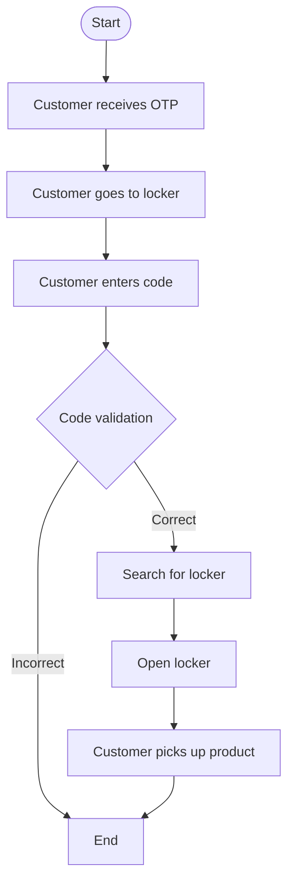

```mermaid
graph TD;
    start([Start]) --> A[Customer receives OTP];
    A --> B[Customer goes to locker];
    B --> C[Customer enters code];
    C --> D{Code validation};
    D -- Incorrect --> endd;
    D -- Correct --> E[Search for locker];
    E --> F[Open locker];
    F --> G[Customer picks up product];
    G --> endd[End];

```
