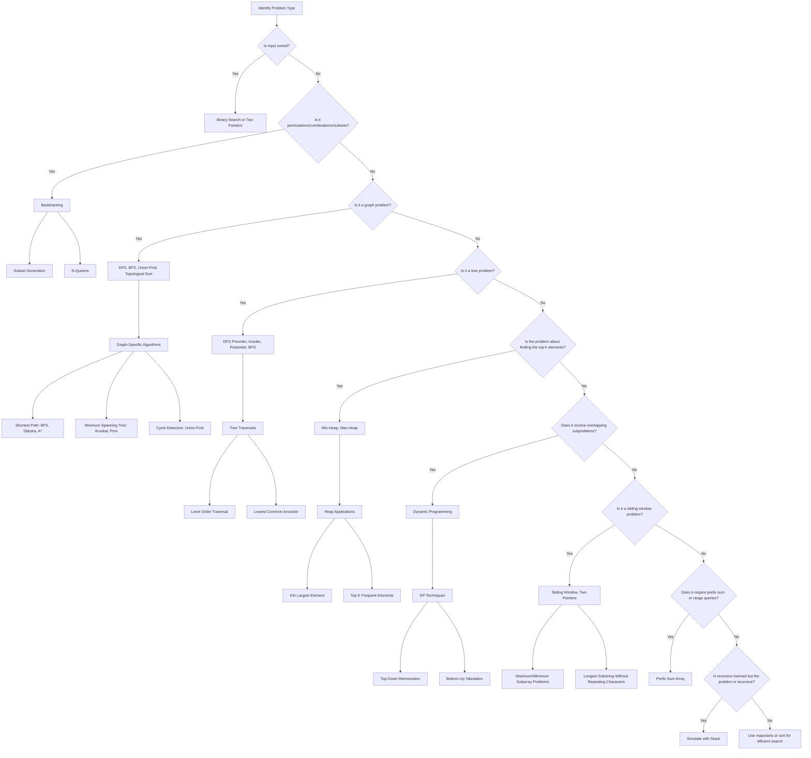

```mermaid
graph TD
    A[Identify Problem Type] --> B1{Is input sorted?}
    B1 -->|Yes| C1[Binary Search or Two Pointers]
    B1 -->|No| B2{Is it permutations/combinations/subsets?}
    B2 -->|Yes| C2[Backtracking]
    B2 -->|No| B3{Is it a graph problem?}
    B3 -->|Yes| C3[DFS, BFS, Union-Find, Topological Sort]
    B3 -->|No| B4{Is it a tree problem?}
    B4 -->|Yes| C4[DFS Preorder, Inorder, Postorder, BFS]
    B4 -->|No| B5{Is the problem about finding the top-k elements?}
    B5 -->|Yes| C5[Min-Heap, Max-Heap]
    B5 -->|No| B6{Does it involve overlapping subproblems?}
    B6 -->|Yes| C6[Dynamic Programming]
    B6 -->|No| B7{Is it a sliding window problem?}
    B7 -->|Yes| C7[Sliding Window, Two Pointers]
    B7 -->|No| B8{Does it require prefix sum or range queries?}
    B8 -->|Yes| C8[Prefix Sum Array]
    B8 -->|No| B9{Is recursion banned but the problem is recursive?}
    B9 -->|Yes| C9[Simulate with Stack]
    B9 -->|No| C10[Use maps/sets or sort for efficient search]

    C3 --> D1[Graph-Specific Algorithms]
    D1 --> E1[Shortest Path: BFS, Dijkstra, A*]
    D1 --> E2[Minimum Spanning Tree: Kruskal, Prim]
    D1 --> E3[Cycle Detection: Union-Find]

    C6 --> D2[DP Techniques]
    D2 --> F1[Top-Down Memoization]
    D2 --> F2[Bottom-Up Tabulation]

    C4 --> D3[Tree Traversals]
    D3 --> G1[Level Order Traversal]
    D3 --> G2[Lowest Common Ancestor]
    
    C5 --> D4[Heap Applications]
    D4 --> H1[Kth Largest Element]
    D4 --> H2[Top K Frequent Elements]

    C2 --> I1[Subset Generation]
    C2 --> I2[N-Queens]
    
    C7 --> J1[Maximum/Minimum Subarray Problems]
    C7 --> J2[Longest Substring Without Repeating Characters]


```
