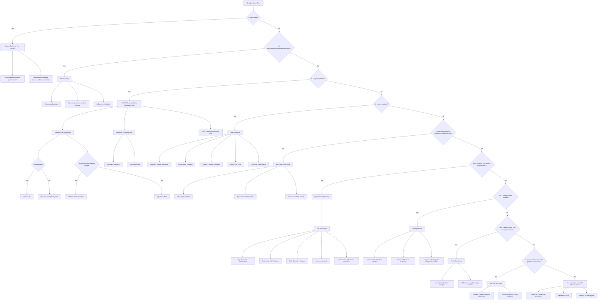

```mermaid
```mermaid
graph TD
    A[Identify Problem Type] --> B1{Is input sorted?}
    B1 -->|Yes| C1[Binary Search or Two Pointers]
    C1 --> C1a[Binary Search if division point needed]
    C1 --> C1b[Two Pointers for range, pairs, or subarray problems]
    B1 -->|No| B2{Is it permutations/combinations/subsets?}
    B2 -->|Yes| C2[Backtracking]
    C2 --> C2a[Generate all subsets]
    C2 --> C2b[Permutations with used set tracking]
    C2 --> C2c[N-Queens or Sudoku]
    B2 -->|No| B3{Is it a graph problem?}
    B3 -->|Yes| C3[DFS, BFS, Union-Find, Topological Sort]
    C3 --> D1[Shortest Path Algorithms]
    D1 --> E1{Is it weighted?}
    E1 -->|Yes| E1a[Dijkstra, A*]
    E1 -->|No| E1b[BFS for unweighted graphs]
    D1 --> E2{Does it contain negative weights?}
    E2 -->|Yes| E2a[Bellman-Ford Algorithm]
    E2 -->|No| E2b[Dijkstra or BFS]
    C3 --> D2[Minimum Spanning Tree]
    D2 --> F1[Kruskal's Algorithm]
    D2 --> F2[Prim's Algorithm]
    C3 --> D3[Cycle Detection with Union-Find]

    B3 -->|No| B4{Is it a tree problem?}
    B4 -->|Yes| C4[Tree Traversals]
    C4 --> G1[Preorder, Inorder, Postorder]
    C4 --> G2[Level Order Traversal]
    C4 --> G3[Lowest Common Ancestor]
    C4 --> G4[Binary Tree Paths]
    C4 --> G5[Balanced Tree Checks]
    B4 -->|No| B5{Is the problem about finding the top-k elements?}
    B5 -->|Yes| C5[Min-Heap, Max-Heap]
    C5 --> H1[Kth Largest Element]
    C5 --> H2[Top K Frequent Elements]
    C5 --> H3[Median in a Data Stream]

    B5 -->|No| B6{Does it involve overlapping subproblems?}
    B6 -->|Yes| C6[Dynamic Programming]
    C6 --> D4[DP Techniques]
    D4 --> F3[Top-Down with Memoization]
    D4 --> F4[Bottom-Up with Tabulation]
    D4 --> F5[State Transition Diagram]
    D4 --> F6[Knapsack Variants]
    D4 --> F7[Fibonacci and Staircase Problems]

    B6 -->|No| B7{Is it a sliding window problem?}
    B7 -->|Yes| C7[Sliding Window]
    C7 --> J1[Fixed or Variable Size Window]
    C7 --> J2[Maximum/Minimum Subarray]
    C7 --> J3[Longest Substring with Unique Characters]

    B7 -->|No| B8{Does it require prefix sum or range queries?}
    B8 -->|Yes| C8[Prefix Sum Array]
    C8 --> K1[Cumulative Sum for Ranges]
    C8 --> K2[Difference Array for Range Updates]

    B8 -->|No| B9{Is recursion banned but the problem is recursive?}
    B9 -->|Yes| C9[Simulate with Stack]
    C9 --> L1[Inorder Traversal without Recursion]
    C9 --> L2[Evaluate Reverse Polish Notation]

    B9 -->|No| C10[Use maps/sets or sort for efficient search]
    C10 --> M1[Two-Sum, Three-Sum Problems]
    C10 --> M2[Frequency Count]
    C10 --> M3[Sorting Custom Objects]
```


```
