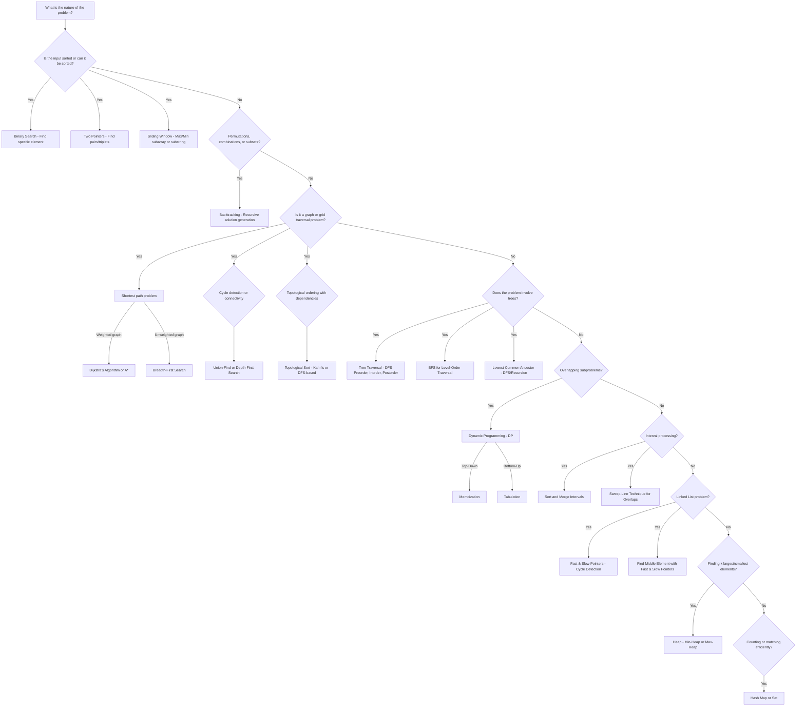

```mermaid
graph TD
  A[What is the nature of the problem?] --> B{Is the input sorted or can it be sorted?}
  B -->|Yes| C[Binary Search - Find specific element]
  B -->|Yes| D[Two Pointers - Find pairs/triplets]
  B -->|Yes| E[Sliding Window - Max/Min subarray or substring]
  B -->|No| F{Permutations, combinations, or subsets?}
  F -->|Yes| G[Backtracking - Recursive solution generation]
  F -->|No| H{Is it a graph or grid traversal problem?}

  H -->|Yes| I[Shortest path problem]
  I -->|Weighted graph| J[Dijkstra's Algorithm or A*]
  I -->|Unweighted graph| K[Breadth-First Search]
  H -->|Yes| L{Cycle detection or connectivity}
  L --> M[Union-Find or Depth-First Search]
  H -->|Yes| N{Topological ordering with dependencies}
  N --> O[Topological Sort - Kahn's or DFS-based]

  H -->|No| P{Does the problem involve trees?}
  P -->|Yes| Q[Tree Traversal - DFS Preorder, Inorder, Postorder]
  P -->|Yes| R[BFS for Level-Order Traversal]
  P -->|Yes| S[Lowest Common Ancestor - DFS/Recursion]

  P -->|No| T{Overlapping subproblems?}
  T -->|Yes| U[Dynamic Programming - DP]
  U -->|Top-Down| V[Memoization]
  U -->|Bottom-Up| W[Tabulation]

  T -->|No| X{Interval processing?}
  X -->|Yes| Y[Sort and Merge Intervals]
  X -->|Yes| Z[Sweep-Line Technique for Overlaps]

  X -->|No| AA{Linked List problem?}
  AA -->|Yes| AB[Fast & Slow Pointers - Cycle Detection]
  AA -->|Yes| AC[Find Middle Element with Fast & Slow Pointers]

  AA -->|No| AD{Finding k largest/smallest elements?}
  AD -->|Yes| AE[Heap - Min-Heap or Max-Heap]

  AD -->|No| AF{Counting or matching efficiently?}
  AF -->|Yes| AG[Hash Map or Set]


```
