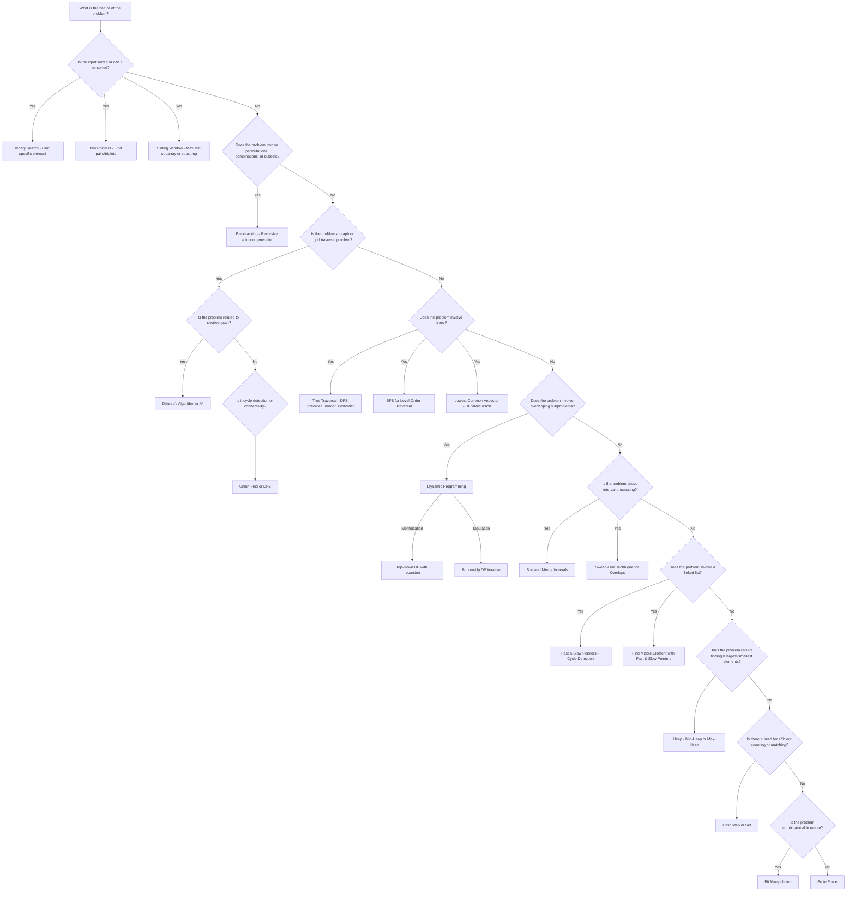

```mermaid
graph TD
  A[What is the nature of the problem?] --> B{Is the input sorted or can it be sorted?}
  B -->|Yes| C[Binary Search - Find specific element]
  B -->|Yes| D[Two Pointers - Find pairs/triplets]
  B -->|Yes| E[Sliding Window - Max/Min subarray or substring]
  B -->|No| F{Does the problem involve permutations, combinations, or subsets?}
  
  F -->|Yes| G[Backtracking - Recursive solution generation]
  F -->|No| H{Is the problem a graph or grid traversal problem?}
  
  H -->|Yes| I{Is the problem related to shortest path?}
  I -->|Yes| J[Dijkstra's Algorithm or A*]
  I -->|No| K{Is it cycle detection or connectivity?}
  K --> L[Union-Find or DFS]
  H -->|No| M{Does the problem involve trees?}
  
  M -->|Yes| N[Tree Traversal - DFS Preorder, Inorder, Postorder]
  M -->|Yes| O[BFS for Level-Order Traversal]
  M -->|Yes| P[Lowest Common Ancestor - DFS/Recursion]
  
  M -->|No| Q{Does the problem involve overlapping subproblems?}
  Q -->|Yes| R[Dynamic Programming]
  R -->|Memoization| S[Top-Down DP with recursion]
  R -->|Tabulation| T[Bottom-Up DP iterative]
  
  Q -->|No| U{Is the problem about interval processing?}
  U -->|Yes| V[Sort and Merge Intervals]
  U -->|Yes| W[Sweep-Line Technique for Overlaps]

  U -->|No| X{Does the problem involve a linked list?}
  X -->|Yes| Y[Fast & Slow Pointers - Cycle Detection]
  X -->|Yes| Z[Find Middle Element with Fast & Slow Pointers]

  X -->|No| AA{Does the problem require finding k largest/smallest elements?}
  AA --> AB[Heap - Min-Heap or Max-Heap]

  AA -->|No| AC{Is there a need for efficient counting or matching?}
  AC --> AD[Hash Map or Set]
  
  AC -->|No| AE{Is the problem combinatorial in nature?}
  AE -->|Yes| AF[Bit Manipulation]
  AE -->|No| AG[Brute Force]
```
