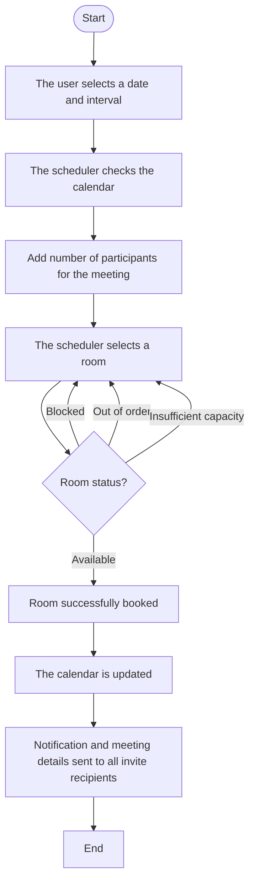

```mermaid
graph TD;
    start([Start]) --> A[The user selects a date and interval];
    A --> B[The scheduler checks the calendar];
    B --> C[Add number of participants for the meeting];
    C --> D[The scheduler selects a room];
    D --> E{Room status?};

    E -- Available --> F[Room successfully booked];
    F --> G[The calendar is updated];
    G --> H[Notification and meeting details sent to all invite recipients];
    H --> I[End];

    E -- Blocked --> D;
    E -- Out of order --> D;
    E -- Insufficient capacity --> D;


```
