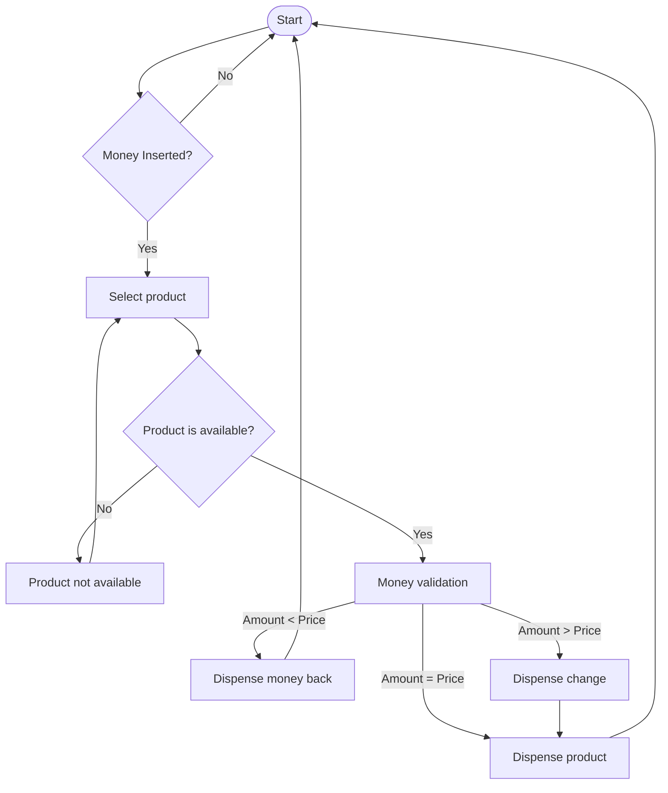

```mermaid
graph TD;
    start([Start]) --> A{Money Inserted?};
    A -- No --> start;
    A -- Yes --> B[Select product];
    B --> C{Product is available?};
    C -- No --> D[Product not available];
    D --> B;
    C -- Yes --> E[Money validation];
    E -- Amount < Price --> F[Dispense money back];
    F --> start;
    E -- Amount = Price --> G[Dispense product];
    G --> start;
    E -- Amount > Price --> H[Dispense change];
    H --> G;

```
